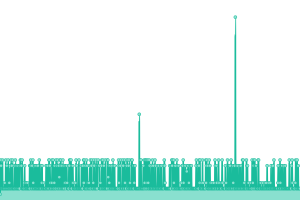

# [📈 Live Status](https://factiverse.github.io/upptime): <!--live status--> **🟧 Partial outage**

This repository contains the open-source uptime monitor and status page for [factiverse](https://factiverse.github.io/upptime), powered by [Upptime](https://github.com/upptime/upptime).

With [Upptime](https://upptime.js.org), you can get your own unlimited and free uptime monitor and status page, powered entirely by a GitHub repository. We use [Issues](https://github.com/factiverse/upptime/issues) as incident reports, [Actions](https://github.com/factiverse/upptime/actions) as uptime monitors, and [Pages](https://factiverse.github.io/upptime) for the status page.

<!--start: status pages-->
<!-- This summary is generated by Upptime (https://github.com/upptime/upptime) -->
<!-- Do not edit this manually, your changes will be overwritten -->
<!-- prettier-ignore -->
| URL | Status | History | Response Time | Uptime |
| --- | ------ | ------- | ------------- | ------ |
|  [Prod API (api.factiverse.ai)](https://api.factiverse.ai/v1/docs) | 🟩 Up | [prod-api-api-factiverse-ai.yml](https://github.com/factiverse/upptime/commits/HEAD/history/prod-api-api-factiverse-ai.yml) | 

 254ms
     
 | 

<a href="https://factiverse.github.io/upptime/history/prod-api-api-factiverse-ai">87.41%</a>
    

|  [DNB Pilot (azure.factiverse.ai)](https://azure.factiverse.ai/v1/docs) | 🟩 Up | [dnb-pilot-azure-factiverse-ai.yml](https://github.com/factiverse/upptime/commits/HEAD/history/dnb-pilot-azure-factiverse-ai.yml) | 

 492ms
     
 | 

<a href="https://factiverse.github.io/upptime/history/dnb-pilot-azure-factiverse-ai">99.30%</a>
    

|  [Ollama](https://ollama.factiverse.ai) | 🟩 Up | [ollama.yml](https://github.com/factiverse/upptime/commits/HEAD/history/ollama.yml) | 

 593ms
     
 | 

<a href="https://factiverse.github.io/upptime/history/ollama">94.84%</a>
    

|  [Factisearch](https://es.factiverse.ai:9200) | 🟥 Down | [factisearch.yml](https://github.com/factiverse/upptime/commits/HEAD/history/factisearch.yml) | 

 0ms
     
 | 

<a href="https://factiverse.github.io/upptime/history/factisearch">0.00%</a>
    

<!--end: status pages-->

[**Visit our status website →**](https://factiverse.github.io/upptime)

## 📄 License

- Powered by: [Upptime](https://github.com/upptime/upptime)
- Code: [MIT](./LICENSE) © [Anand Chowdhary](https://anandchowdhary.com), supported by [Pabio](https://pabio.com)
- Data in the `./history` directory: [Open Database License](https://opendatacommons.org/licenses/odbl/1-0/)
