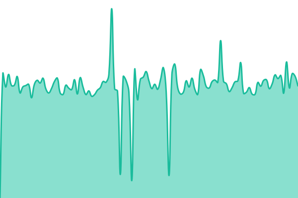
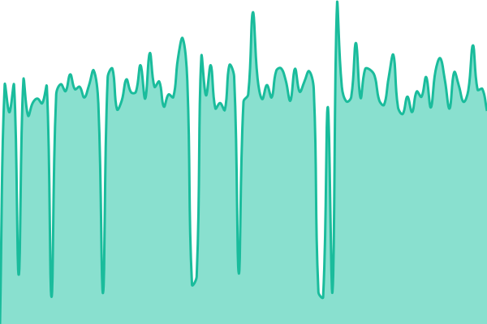

# [📈 Live Status](https://factiverse.github.io/upptime): <!--live status--> **🟩 All systems operational**

This repository contains the open-source uptime monitor and status page for [factiverse](https://factiverse.github.io/upptime), powered by [Upptime](https://github.com/upptime/upptime).

With [Upptime](https://upptime.js.org), you can get your own unlimited and free uptime monitor and status page, powered entirely by a GitHub repository. We use [Issues](https://github.com/factiverse/upptime/issues) as incident reports, [Actions](https://github.com/factiverse/upptime/actions) as uptime monitors, and [Pages](https://factiverse.github.io/upptime) for the status page.

<!--start: status pages-->
<!-- This summary is generated by Upptime (https://github.com/upptime/upptime) -->
<!-- Do not edit this manually, your changes will be overwritten -->
<!-- prettier-ignore -->
| URL | Status | History | Response Time | Uptime |
| --- | ------ | ------- | ------------- | ------ |
|  [POST to /stance_detection](https://api.factiverse.ai/v1/stance_detection) | 🟩 Up | [post-to-stance-detection.yml](https://github.com/factiverse/upptime/commits/HEAD/history/post-to-stance-detection.yml) | 

 1864ms
     
 | 

<a href="https://factiverse.github.io/upptime/history/post-to-stance-detection">100.00%</a>
    

|  [POST to /claim_detection](https://api.factiverse.ai/v1/claim_detection) | 🟩 Up | [post-to-claim-detection.yml](https://github.com/factiverse/upptime/commits/HEAD/history/post-to-claim-detection.yml) | 

 3811ms
     
 | 

<a href="https://factiverse.github.io/upptime/history/post-to-claim-detection">100.00%</a>
    

|  [POST to /fact_check](https://api.factiverse.ai/v1/fact_check) | 🟩 Up | [post-to-fact-check.yml](https://github.com/factiverse/upptime/commits/HEAD/history/post-to-fact-check.yml) | 

 24657ms
     
 | 

<a href="https://factiverse.github.io/upptime/history/post-to-fact-check">100.00%</a>
    

|  [POST to /search](https://api.factiverse.ai/v1/search) | 🟩 Up | [post-to-search.yml](https://github.com/factiverse/upptime/commits/HEAD/history/post-to-search.yml) | 

 13629ms
     
 | 

<a href="https://factiverse.github.io/upptime/history/post-to-search">100.00%</a>
    

|  [POST to /feedback](https://api.factiverse.ai/v1/feedback) | 🟩 Up | [post-to-feedback.yml](https://github.com/factiverse/upptime/commits/HEAD/history/post-to-feedback.yml) | 

 640ms
     
 | 

<a href="https://factiverse.github.io/upptime/history/post-to-feedback">100.00%</a>
    

|  [POST to /claim_search](https://api.factiverse.ai/v1/claim_search) | 🟩 Up | [post-to-claim-search.yml](https://github.com/factiverse/upptime/commits/HEAD/history/post-to-claim-search.yml) | 

 751ms
     
 | 

<a href="https://factiverse.github.io/upptime/history/post-to-claim-search">100.00%</a>
    

|  [POST to /generate](https://api.factiverse.ai/v1/generate) | 🟩 Up | [post-to-generate.yml](https://github.com/factiverse/upptime/commits/HEAD/history/post-to-generate.yml) | 

 1961ms
     
 | 

<a href="https://factiverse.github.io/upptime/history/post-to-generate">100.00%</a>
    

|  [ElasticSearch Uptime](es.factiverse.ai) | 🟩 Up | [elastic-search-uptime.yml](https://github.com/factiverse/upptime/commits/HEAD/history/elastic-search-uptime.yml) | 

 129ms
     
 | 

<a href="https://factiverse.github.io/upptime/history/elastic-search-uptime">100.00%</a>
    

|  [ElasticSearch Health](https://es.factiverse.ai:9200/_cat/health) | 🟩 Up | [elastic-search-health.yml](https://github.com/factiverse/upptime/commits/HEAD/history/elastic-search-health.yml) | 

 428ms
     
 | 

<a href="https://factiverse.github.io/upptime/history/elastic-search-health">100.00%</a>
    

|  [ElasticSearch FactChecks Search](https://es.factiverse.ai:9200/fact_checks/_search) | 🟩 Up | [elastic-search-fact-checks-search.yml](https://github.com/factiverse/upptime/commits/HEAD/history/elastic-search-fact-checks-search.yml) | 

 811ms
     
 | 

<a href="https://factiverse.github.io/upptime/history/elastic-search-fact-checks-search">100.00%</a>
    

|  [app.faciverse.ai](https://app.factiverse.ai) | 🟩 Up | [app-faciverse-ai.yml](https://github.com/factiverse/upptime/commits/HEAD/history/app-faciverse-ai.yml) | 

 242ms
     
 | 

<a href="https://factiverse.github.io/upptime/history/app-faciverse-ai">100.00%</a>
    

|  [test-editor.faciverse.ai](https://test-editor.factiverse.ai) | 🟩 Up | [test-editor-faciverse-ai.yml](https://github.com/factiverse/upptime/commits/HEAD/history/test-editor-faciverse-ai.yml) | 

 214ms
     
 | 

<a href="https://factiverse.github.io/upptime/history/test-editor-faciverse-ai">100.00%</a>
    

|  [Azure util functions - DEV](https://stripesubscriptionstatus-dev-azfbdyf3bvfnhgcq.northeurope-01.azurewebsites.net/api/supported_sites) | 🟩 Up | [azure-util-functions-dev.yml](https://github.com/factiverse/upptime/commits/HEAD/history/azure-util-functions-dev.yml) | 

 2784ms
     
 | 

<a href="https://factiverse.github.io/upptime/history/azure-util-functions-dev">100.00%</a>
    

|  [Azure util functions - PROD](https://stripesubscriptionstatus.azurewebsites.net/api/supported_sites) | 🟩 Up | [azure-util-functions-prod.yml](https://github.com/factiverse/upptime/commits/HEAD/history/azure-util-functions-prod.yml) | 

 2775ms
     
 | 

<a href="https://factiverse.github.io/upptime/history/azure-util-functions-prod">0.00%</a>
    

<!--end: status pages-->

[**Visit our status website →**](https://factiverse.github.io/upptime)

## 📄 License

- Powered by: [Upptime](https://github.com/upptime/upptime)
- Code: [MIT](./LICENSE) © [Anand Chowdhary](https://anandchowdhary.com), supported by [Pabio](https://pabio.com)
- Data in the `./history` directory: [Open Database License](https://opendatacommons.org/licenses/odbl/1-0/)
